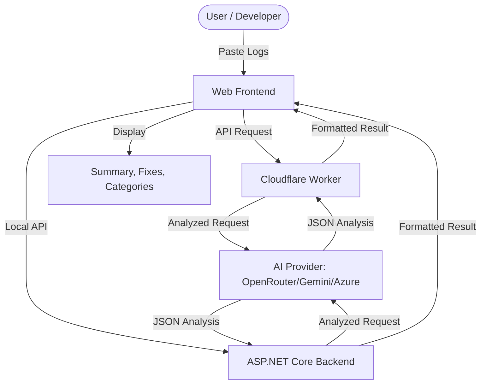

# AI Log Analyzer - Project Documentation

## 1. Overview
**AI Log Analyzer** is a modern, AI-powered debugging assistant designed to transform raw application logs into actionable insights. It leverages state-of-the-art Large Language Models (LLMs) to identify root causes, suggest fixes, and categorize log entries with high precision.

---

## 2. Key Features
- ?? **AI-Powered Root Cause Analysis**: Identifies exactly why an application failed using advanced models like GPT-3.5 and Gemini Pro.
- ? **Instant Fix Suggestions**: Provides step-by-step resolution steps and code snippets.
- ? **Pattern Detection**: Automatically flags common issues like `NullReferenceException`, database timeouts, and authentication failures.
- ?? **Cross-Platform Support**: Analyzes logs from .NET, Node.js, Python, Docker, Kubernetes, and more.
- ?? **Modern Dashboard**: A premium, glassmorphic UI with dark mode and real-time analysis status.
- ?? **Dual-Mode Backend**: 
  - **Local**: ASP.NET Core for developer workflows.
  - **Cloud**: High-performance Cloudflare Worker for global accessibility.

---

## 3. Technology Stack

### Frontend
- **HTML5/CSS3**: Custom modern styling with variable-based tokens and responsive layout.
- **Vanilla JavaScript**: Lightweight, dependency-free UI logic and API integration.
- **Google Fonts**: Clean, high-readability typography (Outfit & Inter).

### Backend
- **Cloud (Production)**: **Cloudflare Workers** (JavaScript/V8) for serverless, low-latency API handling.
- **Local (Dev)**: **ASP.NET Core 8.0** Minimal APIs for robust local development.

### AI Integration
- **OpenRouter**: Access to top-tier models like GPT-3.5-Turbo.
- **Google Gemini Pro**: Integrated via native SDK support.
- **Azure OpenAI**: Enterprise-grade AI support.
- **xAI (Grok)**: Expandable support for Grok-powered analysis.

### DevOps & Tools
- **Version Control**: GitHub.
- **Deployment**: Wrangler CLI (Cloudflare).
- **Environment**: Secret management for API keys on Cloudflare and local appsettings.

---

## 4. Architecture

---

## 5. Use Cases
1. **Developer Self-Service**: Quickly understand cryptic stack traces during local development.
2. **Production Support**: Analyze live production logs to reduce Mean Time to Repair (MTTR).
3. **Log Aggregation Enrichment**: Use as a standardizing layer to turn raw logs into structured data.
4. **Oncall Assistance**: Summarize complex outages into digestible reports for stakeholders.

---

## 6. How it Works
1. **Ingestion**: The user pastes logs into the dashboard.
2. **Pre-processing**: The system performs a "Quick Analysis" using regex to count errors and identify obvious patterns.
3. **Prompt Engineering**: A structured prompt is sent to the LLM, including the logs and context.
4. **Post-processing**: The AI's JSON response is parsed, validated, and rendered onto the UI with proper categorization (Errors, Warnings, Info).

---

© 2024 AI Log Analyzer - Built for the modern developer.
